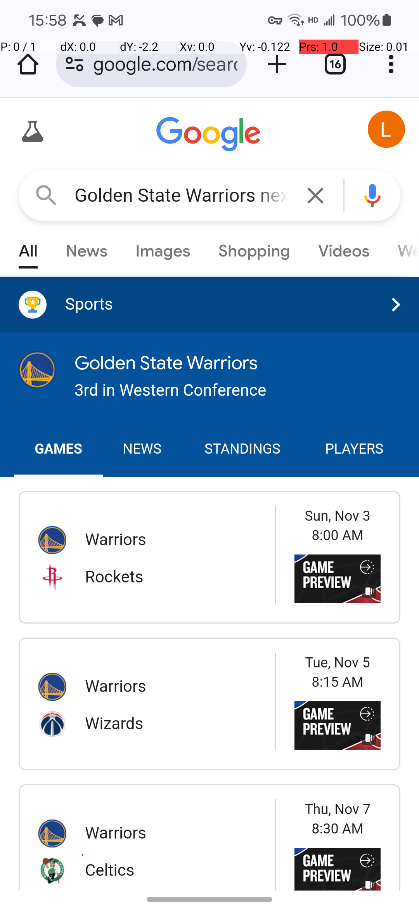

# iPhone Mirroring Agent

The iPhone Mirroring Agent is a Python-based tool that uses Claude AI to automate interactions with a mirrored iPhone screen. It captures screenshots, analyzes them using Claude AI, and performs simulated touch operations based on AI-generated instructions.



## Features

- Screen capture and analysis using Claude AI
- Simulated cursor movements and clicks
- Conversation logging
- Configurable AI model parameters
- User-friendly graphical interface for easy interaction and real-time feedback
- Automatic flashing of the iPhone Mirroring app window when starting a task

## Installation

1. Clone this repository:
   ```
   git clone https://github.com/instapal-ai/iPhoneMirroringAgent.git
   cd iPhoneMirroringAgent
   ```

2. Install the required dependencies using the provided requirements.txt file:
   ```
   pip install -r requirements.txt
   ```

## Usage

Run the script with the following command:

```
python main.py
```

This will launch the graphical user interface. Enter your Anthropic API key, configure the parameters, and provide a task description in the input fields. Click the "Start Task" button to begin the automation process.

## Configuration

The application allows you to configure the following parameters through the GUI:

- API Key: Your Anthropic API key
- Model: The Claude AI model to use (default: "claude-3-5-sonnet-20240620")
- Max Tokens: Maximum number of tokens in Claude's response (default: 2048)
- Temperature: Temperature for Claude's responses (0.0 to 1.0, default: 0.7)
- Max Messages: Maximum number of messages in the conversation (default: 20)
- Task Description: The task you want the agent to perform on the mirrored iPhone screen

## Project Structure

The project is organized into multiple files for better modularity and maintainability:

- `main.py`: Entry point of the application
- `gui.py`: Contains the MainWindow class and GUI-related code
- `agent.py`: Contains the iPhoneMirroringAgent class for interacting with the iPhone mirroring and Claude API
- `constants.py`: Contains constant values like SYSTEM_PROMPT and TOOLS
- `utils.py`: Contains utility functions for window management and flashing

## How It Works

1. When the "Start Task" button is clicked, the application attempts to bring the iPhone Mirroring app window to the front and flash it to draw attention.
2. The script captures a screenshot of the mirrored iPhone screen.
3. The screenshot is sent to Claude AI for analysis.
4. Claude AI provides instructions for the next action (move cursor, click, etc.).
5. The script executes the instructed action using PyAutoGUI.
6. This process repeats until the task is completed or the maximum number of messages is reached.
7. The GUI provides real-time updates on the task progress and displays the current screenshot.

## Limitations

- The script is designed for use with a mirrored iPhone 12 Pro screen. Other device models may require adjustments to the screen resolution and interaction parameters.
- The effectiveness of the automation depends on the quality of the mirrored display and the complexity of the task.
- The script relies on the Anthropic API, so an active internet connection is required.
- The window flashing feature requires the iPhone Mirroring app to be running and visible on the screen.

## Contributing

Contributions to improve the iPhone Mirroring Agent are welcome. Please feel free to submit issues or pull requests.

## License

This project is licensed under the MIT License. See the LICENSE file for details.